<div align="center">

# 🏷️ Azure Tag Analyzer

### 🔍 Analyze and manage tags across your Azure environment with ease

[](https://dotnet.microsoft.com/)
[](https://reactjs.org/)
[](https://www.typescriptlang.org/)
[](https://azure.microsoft.com/)
[](LICENSE)

*A powerful tool that scans all your Azure subscriptions, fetches tags from resource groups and resources, and provides a modern, user-friendly interface to view and search through them.*

[Features](#-features) • [Screenshots](#-screenshots) • [Getting Started](#-getting-started) • [Architecture](#-architecture) • [API Reference](#-api-endpoints) • [Contributing](#-contributing)

---

</div>

## 📸 Screenshots

<div align="center">

### 🎨 User Interface

The application provides a clean, modern interface for managing Azure tags:

- **📋 Tag Table**: View all tags in an organized, sortable table
- **🔍 Search Bar**: Filter tags by key or value in real-time
- **🎚️ Filter Controls**: Toggle resource types and environments
- **🌈 Visual Indicators**: Color-coded environment badges
- **📊 Stats Dashboard**: View tag counts and distribution

> 💡 **Note**: Screenshots will be added soon. The UI features a responsive design with a dark mode option and intuitive controls.

</div>

## ✨ Features

<table>
<tr>
<td width="50%">

### 🌐 Multi-Subscription Support
Automatically scans **all Azure subscriptions** accessible to the authenticated user

### 📦 Comprehensive Tag Collection
Retrieves tags from both **resource groups** and **individual resources**

### 🔎 Advanced Search & Filtering
Filter tags by key and value with **case-insensitive search**
- Filter by resource type (Resource Groups / Resources)
- Filter by environment (Dev / Test / Prod)
- Show only null/empty tag values

</td>
<td width="50%">

### ⚡ Real-time Display
View all tags in an **organized, sortable table** format

### 🎨 Modern UI
React-based frontend with **responsive design** and intuitive controls

### 🚀 Fast & Efficient
Built with modern technologies for optimal performance
- Vite for lightning-fast development
- TypeScript for type safety
- RESTful API architecture

</td>
</tr>
</table>

## 🏗️ Architecture

```mermaid
graph LR
    A[🌐 React Frontend] -->|REST API| B[⚙️ .NET Backend]
    B -->|Azure SDK| C[☁️ Azure Resources]
    C -->|Tags| B
    B -->|JSON| A
    style A fill:#61DAFB,stroke:#333,stroke-width:2px,color:#000
    style B fill:#512BD4,stroke:#333,stroke-width:2px,color:#fff
    style C fill:#0078D4,stroke:#333,stroke-width:2px,color:#fff
```

<div align="center">



</div>

### Backend Stack
- 🔷 **ASP.NET Core 10.0** - Modern web API framework
- ☁️ **Azure Resource Manager SDK** - For Azure resource access
- 🔐 **Azure Identity** - Secure authentication
- 🌐 **RESTful API** - Clean, standard endpoints

### Frontend Stack
- ⚛️ **React 18** - Modern UI library
- 📘 **TypeScript 5** - Type-safe development
- ⚡ **Vite 7** - Next-generation frontend tooling
- 📡 **Axios** - Promise-based HTTP client

## 📋 Prerequisites

Before you begin, ensure you have the following installed:

| Tool | Version | Purpose |
|------|---------|---------|
| 🔷 [.NET SDK](https://dotnet.microsoft.com/download) | 10.0+ | Backend development |
| 📦 [Node.js](https://nodejs.org/) | 18.0+ | Frontend development |
| ☁️ [Azure CLI](https://docs.microsoft.com/cli/azure/install-azure-cli) | Latest | Azure authentication |
| 🔑 Azure Subscription(s) | - | With appropriate permissions |

## 🚀 Getting Started

### 1️⃣ Azure Authentication

Before running the application, authenticate with Azure using one of these methods:

<details>
<summary><b>🔧 Option A: Azure CLI (Recommended for development)</b></summary>

```bash
az login
```

This opens your browser for authentication and is the quickest way to get started.

</details>

<details>
<summary><b>🔐 Option B: Environment Variables</b></summary>

Set the following environment variables for service principal authentication:

```bash
export AZURE_CLIENT_ID="your-client-id"
export AZURE_CLIENT_SECRET="your-client-secret"
export AZURE_TENANT_ID="your-tenant-id"
```

</details>

<details>
<summary><b>☁️ Option C: Managed Identity</b></summary>

When deployed to Azure App Service, Azure VM, or other Azure resources, the app will automatically use the assigned managed identity. No additional configuration needed!

</details>

### 2️⃣ Backend Setup

Navigate to the backend directory and start the API server:

```bash
cd backend
dotnet restore      # Restore dependencies
dotnet build        # Build the project
dotnet run          # Start the server
```

✅ The backend will start on `https://localhost:5001` or `http://localhost:5000`

### 3️⃣ Frontend Setup

In a new terminal, navigate to the frontend directory:

```bash
cd frontend
npm install         # Install dependencies
```

Create your environment configuration:

```bash
cp .env.example .env
```

Edit `.env` and configure the backend URL if different from default:

```env
VITE_API_URL=http://localhost:5000
```

Start the development server:

```bash
npm run dev
```

✅ The frontend will be available at `http://localhost:5173`

## 💡 Usage

1. **🔌 Start the Backend** - Make sure the .NET backend is running
2. **🎨 Start the Frontend** - Launch the React development server
3. **🌐 Open Browser** - Navigate to `http://localhost:5173`
4. **👀 View Tags** - The application automatically fetches all tags from your subscriptions
5. **🔍 Search & Filter** - Use the search form and filters to narrow down results:
   - Search by tag key or value
   - Toggle between Resource Groups and Resources
   - Filter by environment (Dev/Test/Prod)
   - Show only tags with null/empty values

## 🌐 API Endpoints

### `GET /api/tags`
Retrieves all tags from all accessible subscriptions.

**Response**: Array of `TagInfo` objects

```json
[
  {
    "key": "Environment",
    "value": "Production",
    "resourceType": "Microsoft.Compute/virtualMachines",
    "resourceName": "vm-prod-001",
    "resourceGroupName": "rg-production",
    "subscriptionId": "12345678-1234-1234-1234-123456789012",
    "subscriptionName": "Production Subscription"
  }
]
```

### `POST /api/tags/search`
Searches for tags based on key and/or value.

**Request Body**:
```json
{
  "tagKey": "Environment",
  "tagValue": "Production"
}
```

**Response**: Array of filtered `TagInfo` objects

### `GET /api/tags/subscriptions`
Lists all accessible Azure subscriptions.

**Response**: Array of `SubscriptionInfo` objects

```json
[
  {
    "subscriptionId": "12345678-1234-1234-1234-123456789012",
    "displayName": "Production Subscription"
  }
]
```

## 📊 Data Model

### TagInfo

The primary data structure representing a tag in the system:

```typescript
interface TagInfo {
  key: string;              // Tag key (e.g., "Environment")
  value: string;            // Tag value (e.g., "Production")
  resourceType: string;     // Type of resource (ResourceGroup or specific Azure resource type)
  resourceName: string;     // Name of the resource
  resourceGroupName: string; // Name of the resource group
  subscriptionId: string;   // Azure subscription ID (GUID)
  subscriptionName: string; // Azure subscription display name
}
```

## 🔐 Required Azure Permissions

The authenticated user or service principal needs the following permissions:

| Permission | Scope | Purpose |
|------------|-------|---------|
| `Reader` | Subscription Level | Read access to resources and resource groups |
| Tag Read Access | Subscription Level | Read tags from resources |

> 💡 **Tip**: The `Reader` role at the subscription level includes tag read permissions by default.

## 🛠️ Development

### Backend Development (with hot reload)

```bash
cd backend
dotnet watch run
```

Changes to C# files will automatically trigger a rebuild and restart.

### Frontend Development (with hot reload)

```bash
cd frontend
npm run dev
```

Changes to React/TypeScript files will automatically refresh the browser.

### 🏗️ Build for Production

<details>
<summary><b>Backend Production Build</b></summary>

```bash
cd backend
dotnet publish -c Release -o ./publish
```

The compiled application will be in the `publish` directory.

</details>

<details>
<summary><b>Frontend Production Build</b></summary>

```bash
cd frontend
npm run build
```

Optimized static files will be in the `dist` directory.

</details>

## 🔧 Troubleshooting

<details>
<summary><b>🔐 Authentication Issues</b></summary>

**Problem**: Cannot authenticate with Azure

**Solutions**:
- Ensure you're logged in via Azure CLI: `az login`
- Verify your Azure account has access to subscriptions: `az account list`
- Check that you have sufficient permissions to read resources
- If using service principal, verify environment variables are set correctly

</details>

<details>
<summary><b>🌐 Connection Issues</b></summary>

**Problem**: Frontend cannot connect to backend

**Solutions**:
- Verify the backend is running on the correct port (check console output)
- Check CORS settings in `Program.cs` if accessing from different origin
- Ensure the `VITE_API_URL` in `.env` points to the correct backend URL
- Check if firewall or antivirus is blocking the connection

</details>

<details>
<summary><b>📭 No Tags Found</b></summary>

**Problem**: Application shows no tags

**Solutions**:
- Verify your Azure resources have tags applied in Azure Portal
- Ensure you have `Reader` permissions on subscriptions
- Check backend logs for authentication or authorization errors
- Try running: `az tag list` to verify CLI can access tags

</details>

<details>
<summary><b>🐛 Build Errors</b></summary>

**Backend Errors**:
- Run `dotnet restore` to ensure all packages are installed
- Check that .NET 10 SDK is installed: `dotnet --version`

**Frontend Errors**:
- Delete `node_modules` and run `npm install` again
- Clear npm cache: `npm cache clean --force`
- Check Node.js version: `node --version` (should be 18+)

</details>

## 🧰 Technology Stack

<div align="center">

### Backend Technologies

| Technology | Version | Purpose |
|------------|---------|---------|
|  | 10.0 | Web API Framework |
|  | 12 | Programming Language |
|  | Latest | Resource Manager SDK |

### Frontend Technologies

| Technology | Version | Purpose |
|------------|---------|---------|
|  | 18 | UI Library |
|  | 5 | Type-Safe JavaScript |
|  | 7 | Build Tool |

</div>

## 📄 License

This project is licensed under the **MIT License** - see the [LICENSE](LICENSE) file for details.

## 🤝 Contributing

We welcome contributions! Here's how you can help:

1. 🍴 **Fork** the repository
2. 🌟 **Create** a feature branch (`git checkout -b feature/AmazingFeature`)
3. 💾 **Commit** your changes (`git commit -m 'Add some AmazingFeature'`)
4. 📤 **Push** to the branch (`git push origin feature/AmazingFeature`)
5. 🎉 **Open** a Pull Request

### 💡 Contribution Ideas

- 🐛 Report bugs and issues
- 💡 Suggest new features
- 📝 Improve documentation
- 🧪 Add tests
- 🎨 Enhance the UI/UX

---

<div align="center">

**Built with ❤️ for Azure Resource Management**

If you find this tool useful, please consider giving it a ⭐!

</div>

